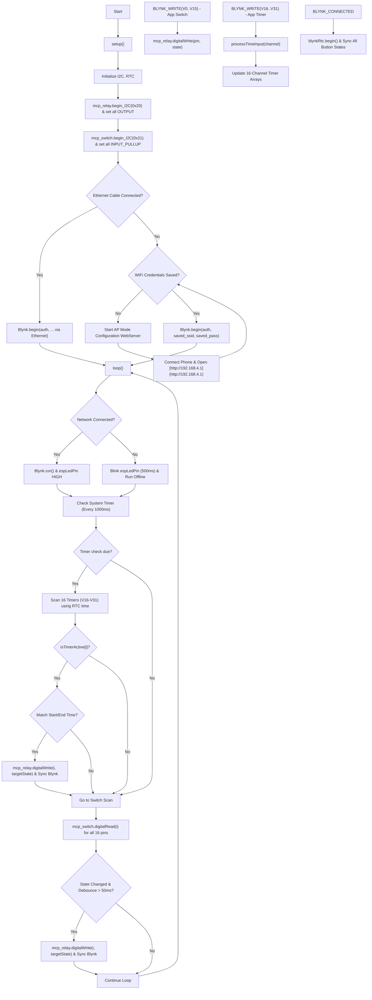

# 🤖 ESP32 Industrial Smart Home Automation (MCP23017 I2C Expander)

ប្រព័ន្ធគ្រប់គ្រងការបិទ-បើកឧបករណ៍អគ្គិសនីកម្រិតឧស្សាហកម្មចំនួន **១៦ ឆានែល (16 Channels)** ដោយប្រើប្រាស់បន្ទះ **MCP23017 I/O Expander ចំនួន ២ គ្រាប់** តាមរយៈខ្សែសញ្ញា I2C តែ ២ ខ្សែ (SDA & SCL) ជួយសន្សំសំចៃជើង GPIO លើ ESP32 យ៉ាងច្រើន។

គម្រោងនេះត្រូវបានរចនាឡើងដើម្បីដំណើរការបានទាំងលក្ខណៈ **Online (Blynk Cloud)** និង **Offline (Local System)** ដោយគ្រប់ឆានែលទាំងអស់ (V0-V15) អាចបញ្ជាបានទាំងដៃ (Physical Switch) និងរត់តាមម៉ោងកំណត់ (Timer) ផ្ទាល់ខ្លួនស្របពេលគ្នា។

---

## 🌐 ប្រព័ន្ធបណ្តាញពីរផ្លូវ & មុខងារ AP Configuration (192.168.4.1)

ប្រព័ន្ធនេះផ្តល់អាទិភាពខ្ពស់ទៅលើស្ថិរភាពបណ្តាញអ៊ីនធឺណិត ដោយគាំទ្រទាំង **Ethernet (ខ្សែ LAN)** និង **WiFi**។

### តើអ្វីទៅជាអាសយដ្ឋាន IP `192.168.4.1`?

នៅពេលដែលប្រព័ន្ធដាច់អ៊ីនធឺណិត ឬមិនទាន់បានកំណត់ WiFi ដំបូង ESP32 នឹងបំប្លែងខ្លួនវាទៅជាឧបករណ៍ផ្សាយ WiFi ផ្ទាល់ខ្លួន (ហៅថា **Captive Portal / Access Point Mode**)។

- អាសយដ្ឋាន **`192.168.4.1`** គឺជា Gateway លំនាំដើម (Default IP Address) របស់ ESP32។
- នៅពេលទូរស័ព្ទរបស់អ្នកភ្ជាប់ទៅកាន់ WiFi របស់ ESP32 ហើយបើក Web Browser វាយលេខ `192.168.4.1` នោះវានឹងបង្ហាញ **ទំព័រវ៉ិបសាយសម្រាប់កំណត់ទិន្នន័យ (WiFi Manager Page)** ភ្លាមៗដោយមិនបាច់ប្រើអ៊ីនធឺណិតឡើយ។ អ្នកអាចជ្រើសរើស WiFi ក្នុងផ្ទះ និងវាយ Password រួចចុច Save នោះ ESP32 នឹងចងចាំទិន្នន័យនេះក្នុង Flash Memory (EEPROM) ជារៀងរហូត។

---

## 🔌 ការកំណត់អាសយដ្ឋាន MCP23017 (I2C Addressing)

ដើម្បីកុំឱ្យជាន់អាសយដ្ឋាន (Address) គ្នានៅលើខ្សែ I2C តែមួយ យើងត្រូវកំណត់ជើង Hardware Address (A0, A1, A2) លើបន្ទះ MCP23017 នីមួយៗដូចខាងក្រោម៖

| ឧបករណ៍ (Device) | ជើង A2 | ជើង A1 | ជើង A0 | I2C Hex Address | មុខងារចម្បង (Function)                     |
| :-------------- | :----: | :----: | :----: | :-------------: | :----------------------------------------- |
| **MCP23017 #1** |  GND   |  GND   |  GND   |   **`0x20`**    | បញ្ជា Output ទៅកាន់ **16-Channel Relay**   |
| **MCP23017 #2** |  GND   |  GND   |  VCC   |   **`0x21`**    | អានទិន្នន័យ Input ពី **16-Channel Switch** |
| **DS3231 RTC**  |   -    |   -    |   -    |   **`0x68`**    | ម៉ូឌុលនាឡិកា (រត់ស្របគ្នានៅលើខ្សែ I2C)     |

---

## 🗺️ គំនូសបំព្រួញលំហូរការងារ (System Flowchart)

